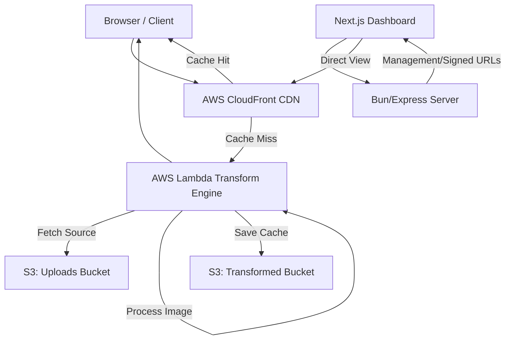

# System Architecture - Dynamic Image Transformation 🏗️

This document details the flow of data and the relationship between components in the transformation pipeline.

## 🗺️ High-Level Request Flow

## 🛠️ Components

### 1. The Proxy Server (Node/Bun)
Acts as the control plane.
- Manages the PostgreSQL image registry.
- Handles direct S3 uploads.
- **Security**: Generates cryptographic HMAC signatures for secure transformation paths.

### 2. The Edge Engine (AWS Lambda + Sharp)
The data plane.
- Triggered by CloudFront on a cache miss.
- Performs on-the-fly image manipulation (resize, format conversion, effects).
- Uses `sharp` optimized for the AWS Lambda environment.

### 3. Storage Layer (S3)
- **Bucket 1 (Images)**: Stores original, high-resolution source images.
- **Bucket 2 (Transformed)**: Stores the output of the Lambda engine for fast subsequent delivery (managed by the engine itself).

### 4. Acceleration Layer (CloudFront)
- Provides edge caching to minimize latency.
- Uses **CloudFront Functions** for lightweight URL rewriting and security checks before hitting the Lambda.

## 🔐 Security Architecture

1. **Total Security Mode**: (Optional) Enforces that EVERY request must be signed with a valid HMAC.
2. **Expired Links**: Transformation URLs include an expiration timestamp (`e`) to prevent link sharing of premium or sensitive assets.
3. **IAM Least Privilege**: All scripts and services run with the minimum necessary AWS permissions.

---

## 🔧 Operational Modes

### Automated Infrastructure
Using `bun run infra:setup` in the `server` directory creates the entire stack (buckets, role, lambda, cloudfront) in ~2 minutes (excluding propagation).

### Manual Configuration
For legacy environments or strict permission controls, see our [AWS Configuration Guide](./AWS_CONFIGURATION.md).
