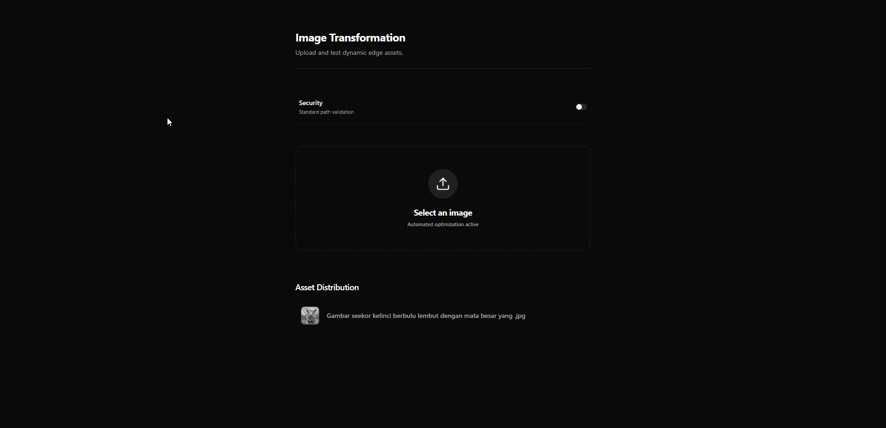

# Dynamic Image Transformation System 🖼️✨

A professional-grade, serverless image transformation pipeline designed for high performance, edge caching, and a premium user experience.



[](./ARCHITECTURE.md)
[](./AWS_CONFIGURATION.md)
[](./LICENSE)

## 🌟 Vision
This project aims to provide an open-source, easily deployable alternative to commercial image CDNs. It leverages AWS Lambda and CloudFront to perform real-time image processing (resizing, conversion, effects) with global edge delivery and intelligent caching.

---

## 🏗️ The Stack

- **Backend (Proxy/API)**: [Bun](https://bun.sh/) + [Express](https://expressjs.com/)
- **Dashboard**: [Next.js 14+](https://nextjs.org/) (App Router) + [TailwindCSS](https://tailwindcss.com/)
- **Compute**: AWS Lambda (Node.js 18.x + [Sharp](https://sharp.pixelplumbing.com/))
- **Delivery**: AWS CloudFront (CDN)
- **Database**: PostgreSQL (Prisma-ready registry)

---

## 🛠️ Local Development & Setup

Follow these steps to get the project running locally for development and testing:

### 1. Clone the Repository
```bash
git clone https://github.com/lwshakib/dynamic-image-transformation-system-architecture.git
cd dynamic-image-transformation-system-architecture
```

### 2. Install Dependencies
This project uses **Bun**. Install dependencies for both the backend and frontend:
```bash
# Root (if applicable) and Workspace modules
cd server && bun install
cd ../web && bun install
```

### 3. Environment Configuration
Create a `.env` file in both the `/server` and `/web` directories using the provided templates:
- **Server**: Copy `server/.env.example` to `server/.env` and add your AWS credentials and database URI.
- **Web**: Copy `web/.env.example` to `web/.env` and update the `NEXT_PUBLIC_API_URL` if necessary.

### 4. Infrastructure Provisioning
Before running the services, you must provision the AWS resources (S3, CloudFront, Lambda):
```bash
cd server
bun run infra:setup
```
*Note: CloudFront propagation can take up to 15-20 minutes.*

### 5. Start the Services
**Proxy API Server:**
```bash
cd server
bun run dev
```

**Dashboard Application:**
```bash
cd web
bun run dev
```
Access the dashboard at `http://localhost:3000`.

---

## 📂 Project Structure

- [`/server`](./server/README.md): Backend API, AWS infrastructure management, and Lambda build automation.
- [`/web`](./web/README.md): Next.js dashboard for image management and transformation previewing.
- [`ARCHITECTURE.md`](./ARCHITECTURE.md): Detailed system diagrams and data flow.
- [`AWS_CONFIGURATION.md`](./AWS_CONFIGURATION.md): Step-by-step guide for manual or automated AWS setup.

---

---

## 🤝 Contributing
We welcome contributions! Please see our [Contributing Guide](./CONTRIBUTING.md) and [Code of Conduct](./CODE_OF_CONDUCT.md).

## 📚 References & Inspiration
This project's architecture is inspired by and aligned with the official AWS Networking & Content Delivery Blog:
- [Image Optimization using Amazon CloudFront and AWS Lambda](https://aws.amazon.com/blogs/networking-and-content-delivery/image-optimization-using-amazon-cloudfront-and-aws-lambda/)

## 📄 License
This project is licensed under the MIT License - see the [LICENSE](./LICENSE) file for details.